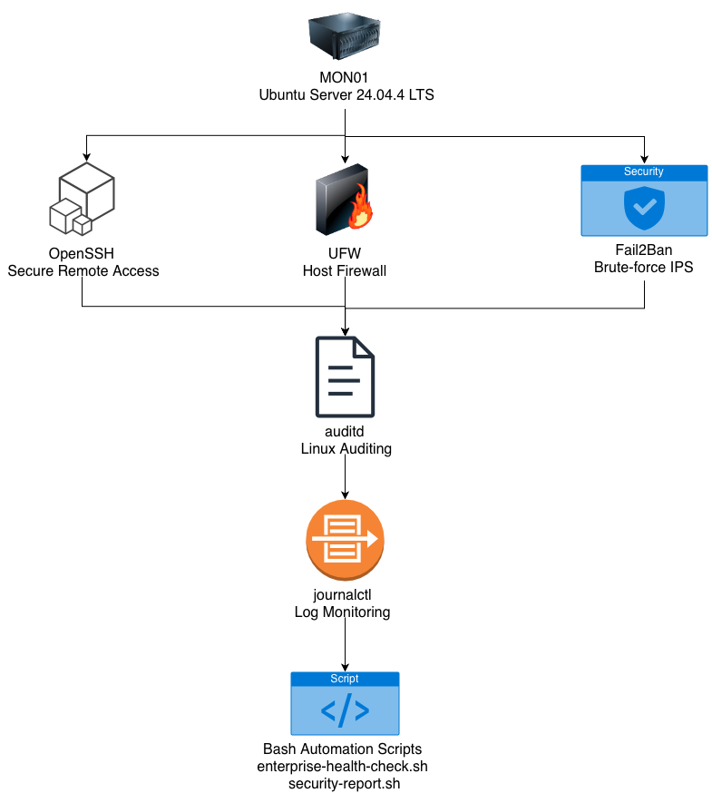

# Enterprise Linux Security Platform

---

## Overview

This project demonstrates the deployment and security hardening of an Ubuntu Server environment following enterprise-oriented Linux administration and security practices.

The project covers secure server configuration, SSH hardening, firewall configuration, intrusion prevention, Linux auditing, security assessment, log monitoring, and Bash automation.

The objective is to build a secure Linux platform while documenting each implementation step and validating security controls through practical testing.

---

## Objectives

- Deploy an Ubuntu Server environment
- Establish a secure Linux baseline
- Harden remote access with OpenSSH
- Configure host-based firewall protection
- Prevent brute-force attacks using Fail2Ban
- Enable Linux auditing with auditd
- Perform security assessment using Lynis
- Monitor authentication and system logs
- Automate operational security checks using Bash

---

## Architecture

---

## Environment

| Component | Details |
|-----------|---------|
| Operating System | Ubuntu Server 24.04.4 LTS ARM64 |
| Virtualization | UTM |
| Host Machine | Apple Silicon MacBook Air M2 |
| Primary Server | MON01 |

---

# Security Controls

| Area | Implementation |
|------|----------------|
| SSH Security | Root login disabled, AllowUsers configuration |
| Firewall | UFW default deny policy with required rules |
| Intrusion Prevention | Fail2Ban SSH protection |
| Linux Auditing | auditd rules and event monitoring |
| Security Assessment | Lynis system audit |
| Log Monitoring | journalctl and authentication logs |

---

# Monitoring

Implemented monitoring of:

- SSH authentication events
- Failed login attempts
- Successful login events
- User management activities
- Audit events
- System boot logs
- CPU usage
- Memory utilization
- Disk usage

---

# Automation

Two Bash automation scripts were developed.

| Script | Description |
|---------|-------------|
| enterprise-health-check.sh | Displays system health and security status |
| security-report.sh | Generates an automated security report |

---

# Technologies

- Ubuntu Server
- Bash
- OpenSSH
- UFW
- Fail2Ban
- auditd
- Lynis
- journalctl
- Git
- GitHub

---

# Documentation

Project documentation includes:

- Ubuntu Server Deployment
- Linux Baseline Configuration
- SSH Hardening
- UFW Firewall Configuration
- Fail2Ban Configuration
- Linux Audit Framework
- Lynis Security Assessment
- Security Monitoring
- Bash Automation
- Troubleshooting Notes

---

# Key Skills Demonstrated

- Linux System Administration
- Linux Security Hardening
- SSH Administration
- Host Firewall Configuration
- Intrusion Prevention
- Linux Auditing
- Log Monitoring
- Security Assessment
- Bash Scripting
- Technical Documentation
- Git Version Control

---

# Project Highlights

✔ Secure Ubuntu Server deployment

✔ SSH hardening and root login restriction

✔ UFW firewall implementation

✔ Fail2Ban intrusion prevention

✔ Linux auditing with auditd

✔ Security assessment using Lynis

✔ Authentication and audit log monitoring

✔ Automated operational health checks

✔ Automated security reporting

---

# Lessons Learned

This project provided hands-on experience in:

- Deploying and securing Linux servers
- Applying security hardening best practices
- Monitoring authentication and audit logs
- Investigating Linux security events
- Validating security configurations
- Automating administrative tasks with Bash
- Producing structured technical documentation

---

# Future Improvements

Potential future enhancements include:

- Wazuh SIEM integration
- Prometheus monitoring
- Grafana dashboards
- Docker deployment
- Centralized log collection
- Security alerting
- Configuration management with Ansible